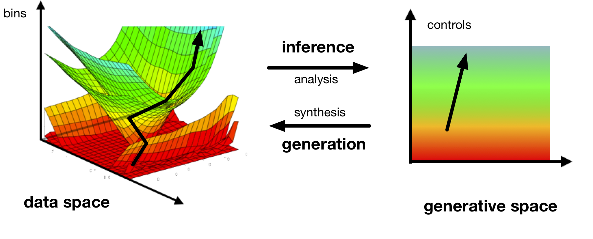
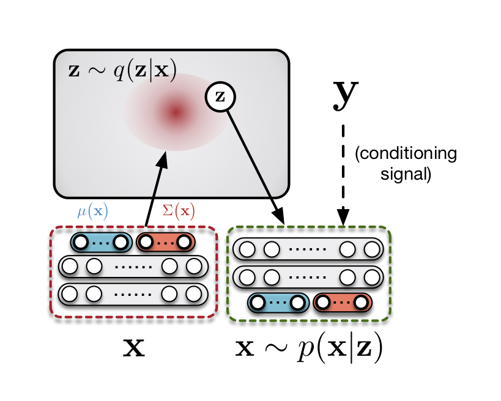
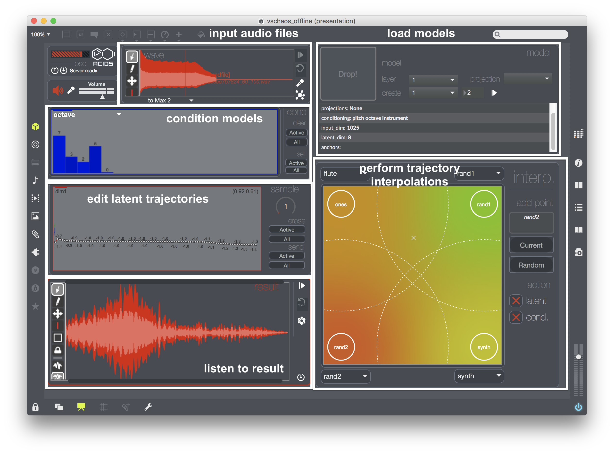
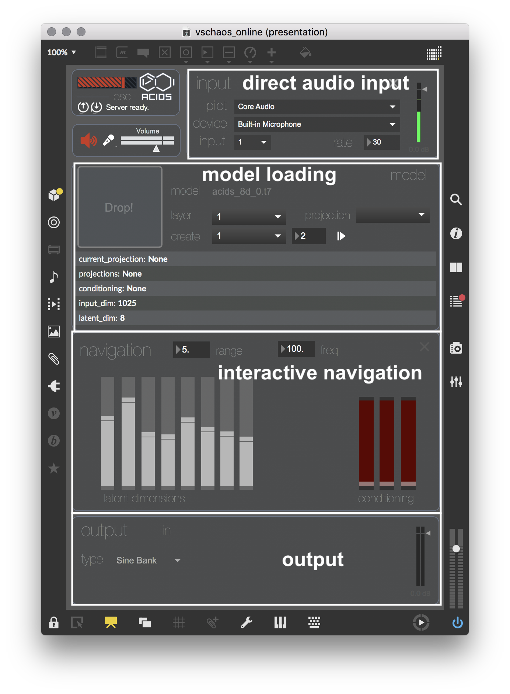

  

 

# vschaos  : a library for variational sound generation

**vschaos** is an open-source library for neural audio generation based on variational learning. This library is under 
GNU GPL and may hence be used for free to use and to distribute. This library aims to open access to neural audio 
generation to both expert and non-expert users through a light and powerful class of generative models, based on *variational
auto-encoding*, whether by using pre-trained models or by training custom models using the high-level Python library,
based on the [pytorch](https://pytorch.org/) library. With this library, we hope to favour an *experimental approach* of 
neural audio synthesis, allowing to be embedded naturally into creative processes (with easy model training and Max/MSP 
patches) and hence to be correctly experienced as generative tools.  

## Variational synthesis for audio
This library is based on a family of generative models based on machine-learning called *variational auto-encoding* 
(see [1]), a powerful balance between *auto-encoders* (see [2]) and *variational learning* (see [3]). Variational
auto-encoding allows to extract a low-dimensional representation from a given dataset, called a *latent space*, that can 
be inverted to *generate* from the extracted features. As this continuous representation is smoothed by an internal 
regularization strategy, the obtained space can be thought as extracting a set of *generative factors* from the data, 
that can be then recombined to extract new sounds.  

Such methods are based on two inverse processes : an *encoding* process, that projects the incoming data onto the 
representation, and a *decoding* process, that converts back the latent point in the data domain. Contrary to classic
auto-encoders, here both generation and representation are defined as probability distributions. These two processes can
also be *conditioned* on external information, allowing to explicitly control some factors of variation such as pitch,
instrument, and many others. 

## Creative possibilities and playgrounds.

Thanks to the flexibility of such frameworks, numerous creative applications are available for direct generation of sound.
Hence, we developed a controllable interface with Max/MSP allowing to directly interact with the model, allowing to 
easily experiment with and explore the representation obtained with several datasets (and more to come). Our framework
is usable both offline and online, and are split in two different playgrounds (as the possible controls are not the same
in these two different temporal settings.)

### Offline methods

* **Generation with trajectories**. The generation of new sounds can be done directly whether by drawing new trajectories in the latent space, or by using a trajectory generator (not yet usable in the interface, work in progress.)  
   *Examples :* acidsInstruments-ordinario  
   

    <audio controls preload="auto" data-setup="{}" width="100%"> 
    <source src="audio/trajectories/line_0_0.wav" type='audio/mp3'>
    </audio> <audio controls preload="auto" data-setup="{}" width="100%"> 
    <source src="audio/trajectories/line_0_8.wav" type='audio/mp3'>
    </audio> <audio controls preload="auto" data-setup="{}" width="100%"> 
    <source src="audio/trajectories/line_0_10.wav" type='audio/mp3'>
    </audio>  <audio controls preload="auto" data-setup="{}" width="100%"> 
    <source src="audio/trajectories/line_0_14.wav" type='audio/mp3'>
    </audio>  <audio controls preload="auto" data-setup="{}" width="100%"> 
    <source src="audio/trajectories/line_0_16.wav" type='audio/mp3'>
    </audio> 
    
 

    

* **Generation with interpolations**. vschaos allows high-level morphing of existing sounds by interpolating between two trajectories obtained from two different files. 
   *Examples :* acidsInstruments-ordinario  
   

   <table> <tr> <td> interpolation 1 </td> 
    <td> <audio controls preload="auto" data-setup="{}" width="100%"> 
    <source src="audio/interpolations/morph_0_2_0.wav" type='audio/mp3'>
    </audio> </td> <td> <audio controls preload="auto" data-setup="{}" width="100%"> 
    <source src="audio/interpolations/morph_0_2_2.wav" type='audio/mp3'>
    </audio> </td> <td> <audio controls preload="auto" data-setup="{}" width="100%"> 
    <source src="audio/interpolations/morph_0_2_4.wav" type='audio/mp3'>
    </audio> </td> <td> <audio controls preload="auto" data-setup="{}" width="100%"> 
    <source src="audio/interpolations/morph_0_2_6.wav" type='audio/mp3'>
    </audio> </td> <td> <audio controls preload="auto" data-setup="{}" width="100%"> 
    <source src="audio/interpolations/morph_0_2_9.wav" type='audio/mp3'>
    </audio> </td> </tr> </table>
    
 
    
    

    <table> <tr> <td> interpolation 2</td>
    <td> <audio controls preload="auto" data-setup="{}" width="100%"> 
    <source src="audio/interpolations/morph_0_4_0.wav" type='audio/mp3'>
    </audio> </td>
    <td> <audio controls preload="auto" data-setup="{}" width="100%"> 
    <source src="audio/interpolations/morph_0_4_3.wav" type='audio/mp3'>
    </audio> </td>
    <td> <audio controls preload="auto" data-setup="{}" width="100%"> 
    <source src="audio/interpolations/morph_0_4_4.wav" type='audio/mp3'>
    </audio> </td> 
    <td> <audio controls preload="auto" data-setup="{}" width="100%"> 
    <source src="audio/interpolations/morph_0_4_5.wav" type='audio/mp3'>
    </audio> </td> 
    <td> <audio controls preload="auto" data-setup="{}" width="100%"> 
    <source src="audio/interpolations/morph_0_4_9.wav" type='audio/mp3'>
    </audio></td> </tr> </table>
    
 
    
    

    <table> <tr> <td> interpolation 3 </td>
    <td><audio controls preload="auto" data-setup="{}" width="100%"> 
    <source src="audio/interpolations/morph_0_6_0.wav" type='audio/mp3'>
    </audio></td>
    <td><audio controls preload="auto" data-setup="{}" width="100%"> 
    <source src="audio/interpolations/morph_0_6_4.wav" type='audio/mp3'>
    </audio></td>
    <td><audio controls preload="auto" data-setup="{}" width="100%"> 
    <source src="audio/interpolations/morph_0_6_5.wav" type='audio/mp3'>
    </audio></td>
    <td><audio controls preload="auto" data-setup="{}" width="100%"> 
    <source src="audio/interpolations/morph_0_6_6.wav" type='audio/mp3'>
    </audio></td>
    <td><audio controls preload="auto" data-setup="{}" width="100%"> 
    <source src="audio/interpolations/morph_0_6_9.wav" type='audio/mp3'>
    </audio></td></tr> </table>
    
 
    
   

 * **Generation with transfer**. What we call generation by transfer, here, is how to train a model on a given database, and then encode and decode audio files from slightly or totally different sources. This is interesting first for evaluating the generalization abilities of the model, but also for creative use where the model will try to *transfer* the learned features to the input sound distribution.  
 

 <table align="center">
  <tr>
    <td> </td>
    <td style="text-align: center; vertical-align: middle;"> Original </td> 
    <td style="text-align: center; vertical-align: middle;"> Reconstruction </td>
  </tr>
  <tr>
    <td style="text-align: center; vertical-align: middle;"> Didgeridoo </td>
    <td style="text-align: center; vertical-align: middle;">
      <audio controls preload="auto" data-setup="{}" width="100%"> 
      <source src="audio/cross/didgeridoo_original.wav" type='audio/mp3'>
      </audio> 
    </td>
    <td style="text-align: center; vertical-align: middle;">
      <audio controls preload="auto" data-setup="{}" width="100%"> 
      <source src="audio/cross/didgeridoo.wav" type='audio/mp3'>
      </audio> 
    </td>
  </tr>
<tr>
    <td style="text-align: center; vertical-align: middle;"> Goats </td>
    <td style="text-align: center; vertical-align: middle;">
      <audio controls preload="auto" data-setup="{}" width="100%"> 
      <source src="audio/cross/Goats_original.wav" type='audio/mp3'>
      </audio> 
    </td>
    <td style="text-align: center; vertical-align: middle;">
      <audio controls preload="auto" data-setup="{}" width="100%"> 
      <source src="audio/cross/Goats.wav" type='audio/mp3'>
      </audio> 
    </td>
  </tr>
  <tr>
    <td style="text-align: center; vertical-align: middle;"> Maracas </td>
    <td style="text-align: center; vertical-align: middle;">
      <audio controls preload="auto" data-setup="{}" width="100%"> 
      <source src="audio/cross/maracas_original.wav" type='audio/mp3'>
      </audio> 
    </td>
    <td style="text-align: center; vertical-align: middle;">
      <audio controls preload="auto" data-setup="{}" width="100%"> 
      <source src="audio/cross/maracas.wav" type='audio/mp3'>
      </audio> 
    </td>
  </tr>
  <tr>
    <td style="text-align: center; vertical-align: middle;"> Seagulls </td>
    <td style="text-align: center; vertical-align: middle;">
      <audio controls preload="auto" data-setup="{}" width="100%"> 
      <source src="audio/cross/seagulls_original.wav" type='audio/mp3'>
      </audio> 
    </td>
    <td style="text-align: center; vertical-align: middle;">
      <audio controls preload="auto" data-setup="{}" width="100%"> 
      <source src="audio/cross/seagulls.wav" type='audio/mp3'>
      </audio> 
    </td>
  </tr>
  <tr>
    <td style="text-align: center; vertical-align: middle;"> Strings </td>
    <td style="text-align: center; vertical-align: middle;">
      <audio controls preload="auto" data-setup="{}" width="100%"> 
      <source src="audio/cross/string_original.wav" type='audio/mp3'>
      </audio> 
    </td>
    <td style="text-align: center; vertical-align: middle;">
      <audio controls preload="auto" data-setup="{}" width="100%"> 
      <source src="audio/cross/string.wav" type='audio/mp3'>
      </audio> 
    </td>
  </tr>
</table>

* **Generation by traduction**. In the case of conditioned models, *generating by traduction* means encoding a sound file from the database with the corresponding symbolic information, and then decoding it with a different context. This can be interesting to evaluate the inter-class consistency of the latent space, and to decline a given sound files in several alternatives.  

### Online methods 

The online playground is based on the real-time exploration / translation of the latent space. I this case the generation time equals the performance time, such that this playground only allows the use of short-term Fourier Transform (STFT) as a valid transform for the model. The processing of incoming / outcoming data is made within Max, where we propose two modes : a mode based on inverse Fourier Transform, that thus proposes several modes of phase inversion, and an inversion through sine banks (only Max 8, using mc features) that can sounds much better yet computationally expensive. 
* **Real-time exploration**. With the offline playground, real-time navigation by live controlling at the same time the latent dimensions and the corresponding conditionings. 
* **Real-time re-synthesis with transfer/traduction**. Another possible case is to use the encoder to project in real time and incoming audio signal, and to resynthesize it in real time with the decoder (given the corresponding label information if the model is conditioned.) 
   
   
## Library

Some tutorials about the features of the library are available [here](). Please note that all the possibilities of the library are not yet available in the playground, such as multi-view auto-encoders, split latent spaces, and some more addditional features. 

### Documentation

(to come)
